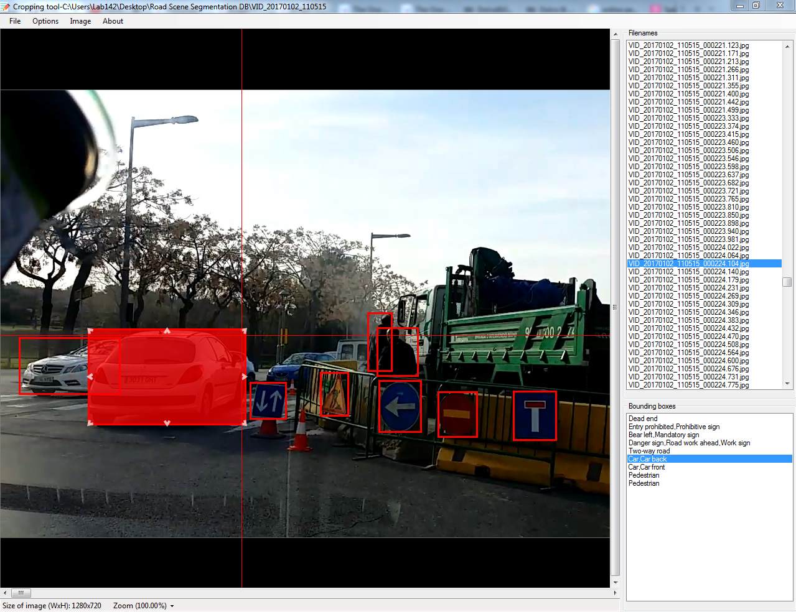

# Bounding box annotation tool

Object detection and classification problems usually requires bounding box information of objects. After collecting a dataset, we usually need to annotate bounding box information of objects in the dataset. The tool provided in this repository can be used for annotating bounding box of objects in images of any size.

It has designed carefully in order to maximize user experience. In addition, the shortcut and GUI design allow fast annotation. This tool is written in C# using Visual Studio 2010 and it still under development.

## Features
* Class management
..* Insert/delete classes
..* Sort class labels
* Multi label annotation
* Zooming
* Efficient design of shortcuts
* Deleting bounding boxes
* Editing bounding boxes
..* Moving
..* Resizing
..* Editing labels
* Showing recently used labels for annotating image sequences faster
* Controlling bounding box color

